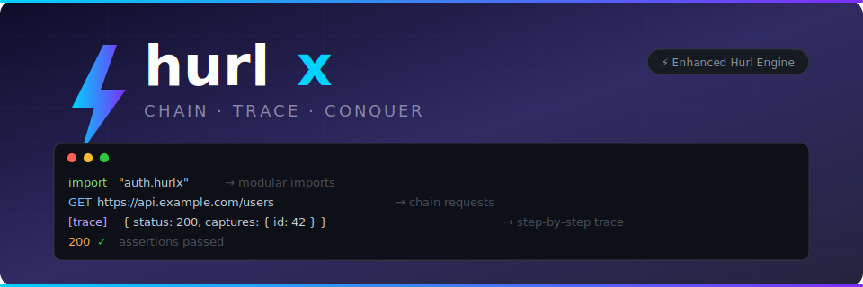

<p align="center">
  
</p>

<p align="center">
  
  
  
</p>

**hurlx** is an enhanced version of [Hurl](https://hurl.dev), designed for modern API engineering workflows.

Fully compatible with all Hurl features, hurlx **uniquely supports import/export syntax**, making HTTP testing more modular and maintainable.

---

## ✨ Key Features

### 🔄 Modular Import/Export

**Core Feature**: Import and export capabilities for modular API testing

**Example 1: Authentication Module**
```hurlx
# auth.hurlx
POST https://api.example.com/login
[JSON]
{
  "username": "{{username}}",
  "password": "{{password}}"
}
HTTP 200
[Captures]
token: jsonpath "$.token"
expires: jsonpath "$.expires_at"

export token
export expires
```

**Example 2: Reusing Authentication**
```hurlx
# api-test.hurlx
import "auth.hurlx"

GET https://api.example.com/users
Authorization: Bearer {{token}}
HTTP 200
[Asserts]
jsonpath "$.length()" > 0
```

**Example 3: Multi-file Workflow**
```hurlx
# config.hurlx
# Common configuration
export base_url = "https://api.example.com"
export api_version = "v1"
```

```hurlx
# endpoints.hurlx
import "config.hurlx"

export users_endpoint = "{{base_url}}/{{api_version}}/users"
export products_endpoint = "{{base_url}}/{{api_version}}/products"
```

```hurlx
# test.hurlx
import "auth.hurlx"
import "endpoints.hurlx"

GET {{users_endpoint}}
Authorization: Bearer {{token}}
HTTP 200
```

**Benefits**:
- ✅ Reuse authentication, configuration, and endpoint definitions
- ✅ Better team collaboration with shared modules
- ✅ Modular test cases that are easy to maintain
- ✅ Reduce duplication across test files
- ✅ Centralize configuration management

### 📊 Advanced Assertions

**Core Feature**: Powerful assertion capabilities for comprehensive testing

**Example 1: JSON Assertions**
```hurlx
GET https://api.example.com/user/1
HTTP 200
[Asserts]
jsonpath "$.name" == "John Doe"
jsonpath "$.age" > 18
jsonpath "$.email" matches "^[a-zA-Z0-9._%+-]+@[a-zA-Z0-9.-]+\\.[a-zA-Z]{2,}$"
jsonpath "$.address.city" exists
```

**Example 2: Response Time Assertion**
```hurlx
GET https://api.example.com/health
HTTP 200
[Asserts]
duration < 500ms
```

**Example 3: Type Checking**
```hurlx
GET https://api.example.com/user/1
HTTP 200
[Asserts]
jsonpath "$.id" isInteger
jsonpath "$.active" isBoolean
jsonpath "$.created_at" isIsoDate
jsonpath "$.tags" isList
jsonpath "$.profile" isObject
```

### 🔗 Variable Chaining

**Core Feature**: Chain variables across requests for complex workflows

**Example: Multi-step Authentication**
```hurlx
# Step 1: Get CSRF token
GET https://api.example.com/login
HTTP 200
[Captures]
csrf_token: xpath "//input[@name='csrf_token']/@value"

# Step 2: Login with CSRF token
POST https://api.example.com/login
[Form]
username: admin
password: password
csrf_token: {{csrf_token}}
HTTP 302
[Captures]
session_id: cookie "session_id"

# Step 3: Access protected resource
GET https://api.example.com/dashboard
Cookie: session_id={{session_id}}
HTTP 200
```

### 🎯 Template System

**Core Feature**: Dynamic value generation for tests

**Example: Dynamic Values**
```hurlx
POST https://api.example.com/users
[JSON]
{
  "id": "{{uuid}}",
  "created_at": "{{date 'yyyy-MM-dd'T'HH:mm:ss.SSS'Z'}}",
  "api_key": "{{randomHex 32}}",
  "environment": "{{getenv 'ENVIRONMENT'}}",
  "message": "Hello {{name}}"
}
HTTP 201
```

### 🔧 Engineering-Ready

**Core Feature**: Tools for professional API engineering workflows

**Example: Complete Test Suite**
```hurlx
# tests/setup.hurlx
# Setup test environment
export base_url = "https://api-staging.example.com"
export test_user = "test@example.com"
export test_pass = "Test123!"
```

```hurlx
# tests/auth.hurlx
import "setup.hurlx"

POST {{base_url}}/auth/login
[JSON]
{
  "email": "{{test_user}}",
  "password": "{{test_pass}}"
}
HTTP 200
[Captures]
token: jsonpath "$.token"

export token
```

```hurlx
# tests/users.hurlx
import "auth.hurlx"

# Test user creation
POST {{base_url}}/users
Authorization: Bearer {{token}}
[JSON]
{
  "name": "Test User",
  "email": "newuser@example.com"
}
HTTP 201
[Captures]
user_id: jsonpath "$.id"

# Test user retrieval
GET {{base_url}}/users/{{user_id}}
Authorization: Bearer {{token}}
HTTP 200
[Asserts]
jsonpath "$.name" == "Test User"

# Test user deletion
DELETE {{base_url}}/users/{{user_id}}
Authorization: Bearer {{token}}
HTTP 204
```

---

## 🚀 vs Hurl

| Feature | Hurl | hurlx |
|---------|------|-------|
| Basic HTTP Testing | ✅ | ✅ |
| JSON/XML Assertions | ✅ | ✅ |
| Variables & Templates | ✅ | ✅ |
| Filters & Predicates | ✅ | ✅ |
| **Modular Import/Export** | ❌ | ✅ |
| **Structured Test Cases** | ❌ | ✅ |
| **Engineering-Ready** | ❌ | ✅ |

> hurlx = Hurl superset + modular capabilities

---

## 📦 Features

### HTTP Methods
- GET, POST, PUT, DELETE, PATCH, HEAD, OPTIONS

### Request Configuration
- Query parameters, Form data, Multipart uploads
- Basic Auth, Bearer Token, custom Headers
- JSON/XML/Text/Base64 request body
- File uploads

### Response Assertions
- Status code assertions (wildcard `*` supported)
- Header assertions
- Body assertions (exact match, JSONPath, XPath, Regex)
- Type checks (`isString`, `isInteger`, `isList`, `isObject`, `isUuid`, `isIsoDate`, etc.)

### Advanced Features
- Variable chaining
- Chain trace (`--trace`)
- Conditional assertions
- Retry mechanism
- Redirect tracking
- Timeout control
- Proxy support
- HTTPS / Certificate management

---

## 🛠️ Installation

### Binary Installation

```bash
# macOS (Apple Silicon)
curl -L https://github.com/wei-lli/hurlx/releases/latest/download/hurlx-1.0.0-darwin-arm64 -o hurlx
chmod +x hurlx

# macOS (Intel)
curl -L https://github.com/wei-lli/hurlx/releases/latest/download/hurlx-1.0.0-darwin-amd64 -o hurlx
chmod +x hurlx

# Linux
curl -L https://github.com/wei-lli/hurlx/releases/latest/download/hurlx-1.0.0-linux-amd64 -o hurlx
chmod +x hurlx

# Windows
curl -L https://github.com/wei-lli/hurlx/releases/latest/download/hurlx-1.0.0-windows-amd64.exe -o hurlx.exe
```

### Go Install

```bash
go install github.com/wei-lli/hurlx/cli
```

### Build from Source

```bash
git clone https://github.com/wei-lli/hurlx.git
cd hurlx
go build -o hurlx ./cli
```

---

## 📖 Quick Start

### Basic Usage

```hurlx
# hello.hurlx
GET https://example.com
HTTP 200
```

```bash
hurlx hello.hurlx
```

### Test Mode

```bash
hurlx --test hello.hurlx
```

### Using Variables

```bash
hurlx --variable host=api.example.com api.hurlx

# or load from file
hurlx --variables-file env.json api.hurlx
```

### Chain Trace

When using `import` or chaining multiple requests, use `--trace` to print each step's result as JSON to stderr:

```bash
hurlx --trace api.hurlx
```

Example output (stderr):
```json
[trace] {
  "entry": 1,
  "method": "POST",
  "url": "https://api.example.com/login",
  "status": 200,
  "body": "{\"token\":\"abc123\"}",
  "captures": {"token": "abc123"},
  "duration": 150
}
[trace] {
  "entry": 2,
  "method": "GET",
  "url": "https://api.example.com/users",
  "status": 200,
  "body": "[{\"id\":1}]",
  "duration": 80
}
```

### Import/Export Example

```hurlx
# login.hurlx - Login and export token
POST https://api.example.com/login
[JSON]
{
  "username": "admin",
  "password": "admin"
}
HTTP 200
[Captures]
token: jsonpath "$.token"

# Export token for other files
export token
```

```hurlx
# main.hurlx - Import and use
import "login.hurlx"

GET https://api.example.com/users
Authorization: Bearer {{token}}
HTTP 200
```

---


## 🔧 CLI Options

```
hurlx [options] [FILE...]

Options:
  -4                      Use IPv4 only
  -6                      Use IPv6 only
  -L, -location           Follow redirects
  -V value                Define variable
  --compressed            Request compressed response
  --connect-timeout       Connection timeout
  --continue-on-error     Continue on assert errors
  --insecure, -k          Allow insecure SSL connections
  --json                  JSON output
  --test                  Test mode (assertions only)
  --timeout, -m           Maximum time per request
  --trace                 Trace each chain step result as JSON
  --retry                 Retry count
  --variable, -V          Define variable
  --variables-file       Load variables from file
  --verbose, -v          Verbose output
  --very-verbose         More verbose output
  -i, --include          Include HTTP headers in output
  -o, --output           Output file
```

---

## 📊 Test Coverage

| Category | Coverage |
|----------|----------|
| HTTP Methods | 100% |
| Request Sections | 100% |
| Request Body Types | 100% |
| Response Assertions | 100% |
| Queries (JSONPath, XPath, Regex, etc.) | 100% |
| Predicates | 100% |
| Filters | 95%+ |
| Templates | 100% |
| Captures | 100% |
| Import/Export | 100% |

---

## 🤝 Contributing

Issues and Pull Requests are welcome!

---

## 📄 License

MIT License - see [LICENSE](LICENSE) for details.

---

## 🙏 Acknowledgments

- [Hurl](https://hurl.dev) - Powerful HTTP testing tool
- All contributors and test users